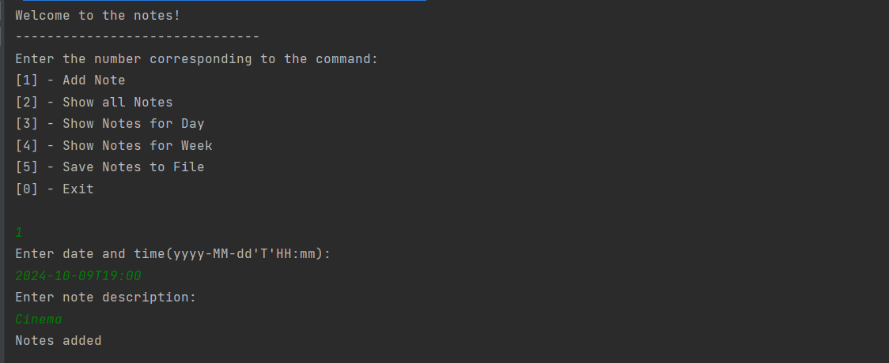
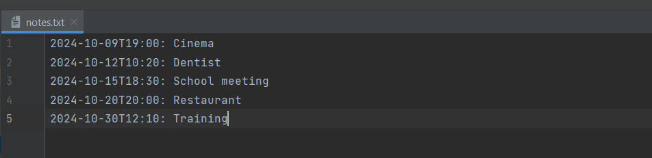
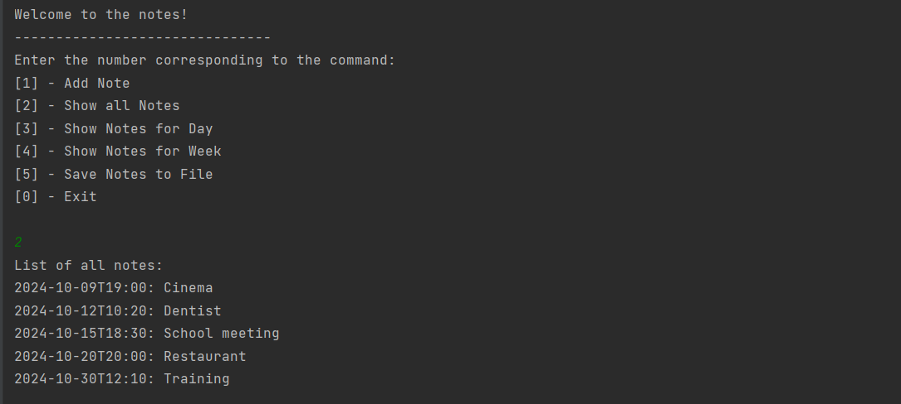
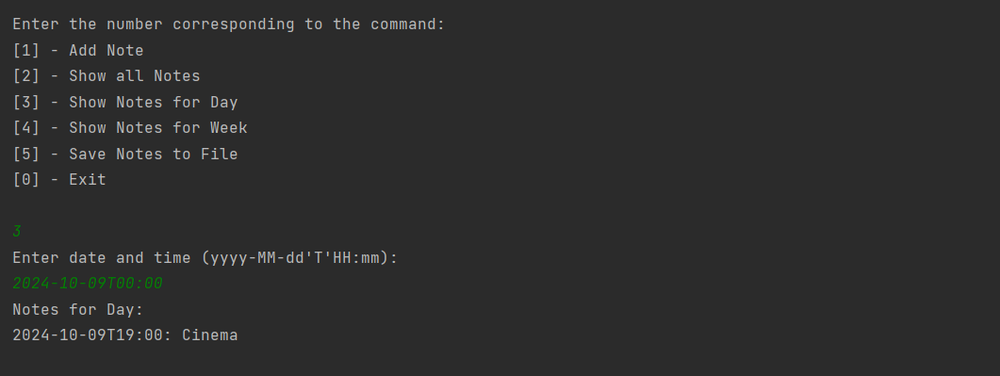
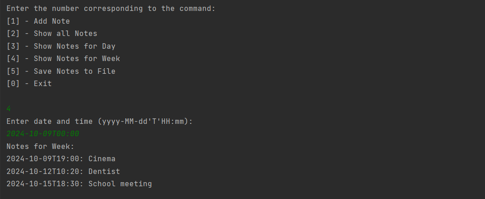
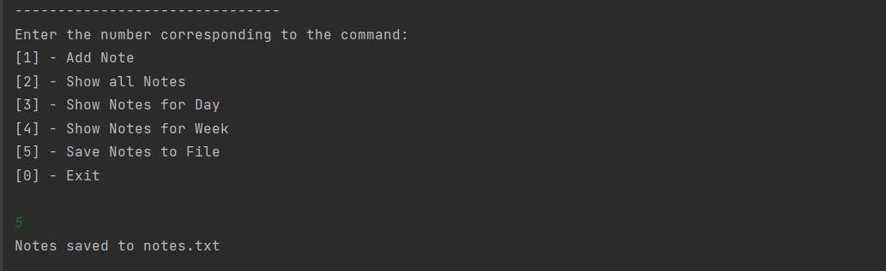
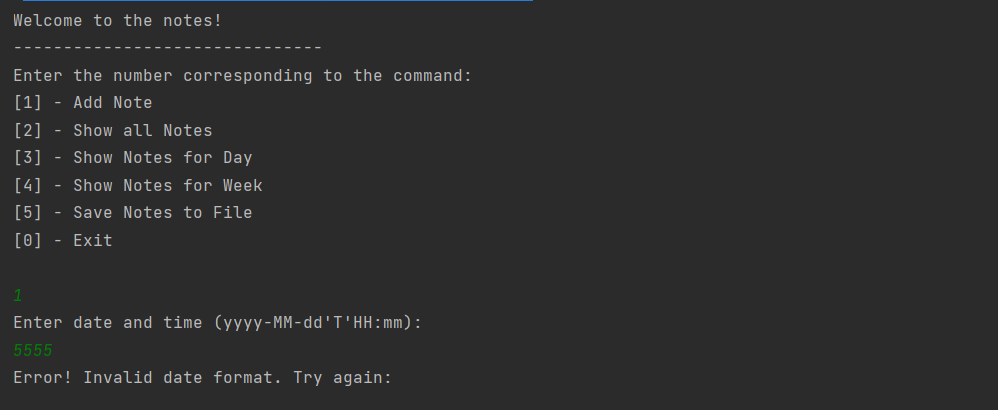

# Задание:
Необходимо реализовать проект удовлетворяющий изученному материалу.
Проект содержит интерфейсы, реализован с использованием MVP паттерна, удовлетворяет всем принципам SOLID. 
Создать проект с записной книжкой. Идея в том, что пользователь может делать записи на различные дни 
(например в 19:00 стоматолог), читать записи, сохранять и загружать в файл, сортировать, 
искать записи на конкретный день или неделю.
Приложение должно быть консольным

-----------------------------------------

# Демонстрация решения:

## Добавление записи:

-----------------------------------------

## Сохраненные записи:

-----------------------------------------

## Просмотр всех записей:

-----------------------------------------

## Поиск записи на заданный день:

-----------------------------------------

## Поиск записи на заданную неделю:

-----------------------------------------

## Сохранение записи в файл:

----------------------------------------

## Обработка даты:
